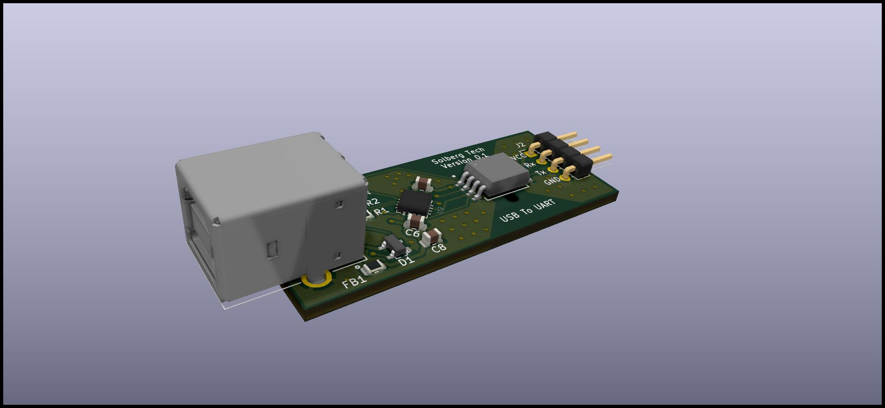
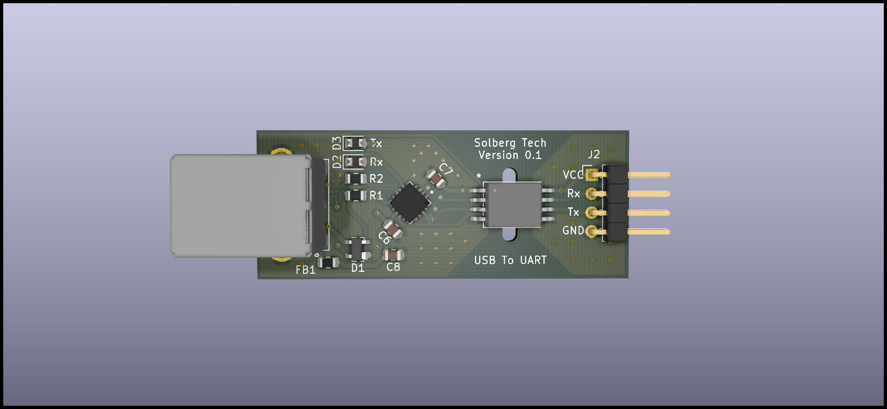
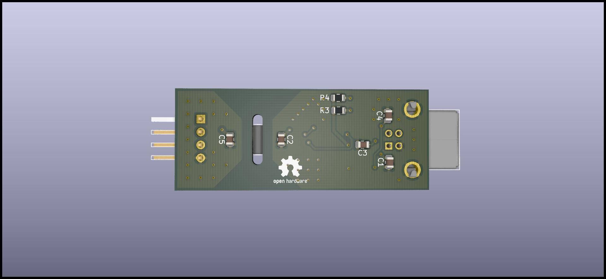

# Isolated-USB-To-UART
### A Simple 5kV Isolated USB To UART Bridge

The isolated USB to UART Bridge works with Baudrates from 300 baud to 3 Mbaud. 
It can withstand 5000Vrms for 1 minute. 
And 565Vpeak Continuously, without destroying your computer. 

It can opperate with a circuit voltage from 1.8V to 5V.

This work   is licensed under <a rel="license" href="https://creativecommons.org/licenses/by-sa/4.0">CC BY-SA 4.0</a>

